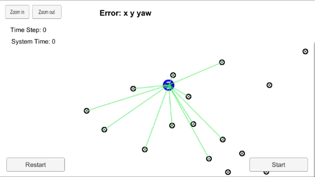

# Particle Filter (Localization) - Kidnapped Vehicle


My robot vehicle has been kidnapped and transported to a new location! Luckily it has a map of this location, a (noisy) GPS estimate of its initial location, and lots of (noisy) sensor and control data.

> Above is a video capture of the sumulator when it is able to successfully track the car to a particle. Notice that the green laser sensors from the car nearly overlap the blue laser sensors from the particle, indicating that the particle transition calculations were done correctly. See the complete [video](./videos/particle-filter.mp4) of the simulator tracking the car to successful completion.

## The Project
Given a map, initial localization information (similar to data provided by a GPS), and, at each time step, observation and control data, I implement a 2-dimensional particle filter in C++ to allow the robot vehicle to self identify its location. 

## Running the Code
This project is comprised of a Simulator server and the filter particle program.

* The **Simulator** can be downloaded [here](https://github.com/udacity/self-driving-car-sim/releases)

1. Download the simulator and open it. In the main menu screen select Project 3: Kidnapped Vehicle.

2. Once the scene is loaded you can hit the START button to observe how the car drives and observes landmarks. At any time you can press the PAUSE button, to pause the scene or hit the RESTART button to reset the scene. Also the ARROW KEYS can be used to move the camera around, and the top left ZOOM IN/OUT buttons can be used to focus the camera. Pressing the ESCAPE KEY returns to the simulator main menu.


* The **Particle Filter** client program
This repository includes two files that can be used to set up and intall uWebSocketIO for either Linux (`install-ubuntu.sh`) or Mac (`install-mac.sh`) systems. For windows you can use either Docker, VMware, or even Windows 10 Bash on Ubuntu to install uWebSocketIO.

> The uWebSocketIO API is used in the main program to connect to the Simulator server.

##### Building the Project
Once the uWebSocketIO is installed, the main particle filter program can be built and run by doing the following from the project top directory.

1. mkdir build
2. cd build
3. cmake ..
4. make
5. ./particle_filter

Alternatively, some scripts have been included to streamline the build process. Execute the following in the top directory of the project:

1. ./clean.sh
2. ./build.sh
3. ./run.sh

> **Tips** for setting up your environment can be found [here](https://classroom.udacity.com/nanodegrees/nd013/parts/40f38239-66b6-46ec-ae68-03afd8a601c8/modules/0949fca6-b379-42af-a919-ee50aa304e6a/lessons/f758c44c-5e40-4e01-93b5-1a82aa4e044f/concepts/23d376c7-0195-4276-bdf0-e02f1f3c665d)


##### Communicating with the Sumulator
Here is the main protcol that `main.cpp` uses for `uWebSocketIO` in communicating with the simulator.

* **INPUT**: values provided by the simulator to the C++ program:
```
    // sense noisy position data from the simulator

    ["sense_x"] 

    ["sense_y"] 

    ["sense_theta"] 

    // get the previous velocity and yaw rate to predict the particle's transitioned state

    ["previous_velocity"]

    ["previous_yawrate"]

    // receive noisy observation data from the simulator, in a respective list of x/y values

    ["sense_observations_x"] 

    ["sense_observations_y"] 
```

* **OUTPUT**: values provided by the c++ program to the simulator:
```
    // best particle values used for calculating the error evaluation

    ["best_particle_x"]

    ["best_particle_y"]

    ["best_particle_theta"] 

    //Optional message data used for debugging particle's sensing and associations

    // for respective (x,y) sensed positions ID label 

    ["best_particle_associations"]

    // for respective (x,y) sensed positions

    ["best_particle_sense_x"] <= list of sensed x positions

    ["best_particle_sense_y"] <= list of sensed y positions
```


## Inputs to the Particle Filter
You can find the inputs to the particle filter in the `data` directory. 

* #### The Map*
`map_data.txt` includes the position of landmarks (in meters) on an arbitrary Cartesian coordinate system. Each row has three columns
1. x position
2. y position
3. landmark id

* ### All other data the simulator provides, such as observations and controls.

> *Map data provided by 3D Mapping Solutions GmbH.


